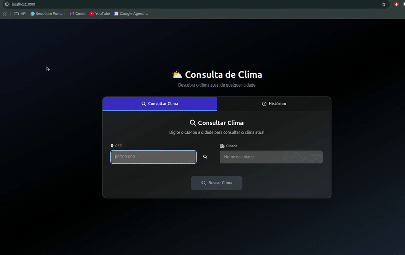

# Sistema de Consulta Climática
Sistema web para consulta de condições climáticas em tempo real com armazenamento de histórico de consultas.




## Tecnologias Utilizadas

### Backend
- PHP 8.4
- MySQL 8
- Nginx
- Composer

### Frontend
- React
- Node.js 20
- NPM

## Requisitos

- Docker Engine
- Docker Compose
- Git

## Instalação e Execução

1. Clone o repositório
```bash
  git clone https://github.com/Angelo-Luiz/consultar-clima.git
  cd consultar-clima
```

2. Faça o build do ambiente com as dependências do projeto
``` bash
  docker compose up -d --build
```

3. Instale as dependências do composer no container php
```bash
  docker compose exec php-84-fpm composer install
```

4. Se tudo ocorreu com sucesso a aplicaçaõ poderá ser acessada em `http://localhost:3000`


## Estrutura do Projeto

## 1. Ponto de Entrada

**`/public/index.php`**  
Arquivo principal que inicializa a aplicação PHP, carrega as dependências e direciona as requisições para os controladores apropriados.

---

## 2. Conexão com o Banco de Dados

**`/src/Database/Impl/Database.php`**  
Classe responsável pela conexão com o banco de dados.

- Implementada como **Singleton**, garantindo que exista apenas uma instância ativa de conexão durante todo o ciclo da aplicação.
- Essa abordagem evita múltiplas conexões desnecessárias, melhora a performance e centraliza a configuração de acesso ao banco.

---

## 3. Arquitetura e Organização

A aplicação segue um modelo de **monólito modular**, utilizando **injeção de dependências com PHP-DI** para garantir baixo acoplamento e facilitar a manutenção.

### Camadas principais

#### `/src/Controller`
- Camada de apresentação e orquestração.
- Recebe as requisições externas (ex.: HTTP).
- Invoca os serviços adequados.
- Retorna a resposta (JSON, HTML, etc.).

#### `/src/Service`
- Camada de regras de negócio.
- Contém a lógica central da aplicação.
- Define fluxos e validações.
- Interage com os repositórios para obter ou persistir dados.

#### `/src/Repository`
- Camada de persistência.
- Isola a lógica de acesso a dados.
- Responsável por interações com o banco de dados.
- Fornece métodos de consulta e manipulação de entidades.  
